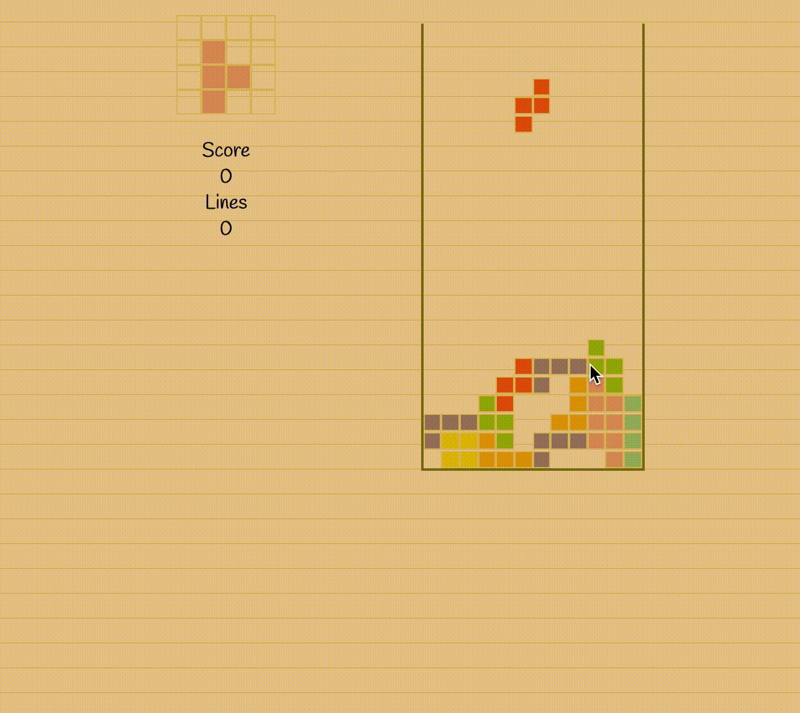
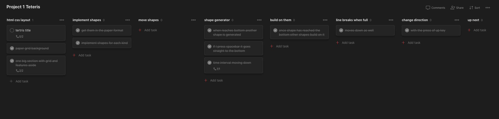
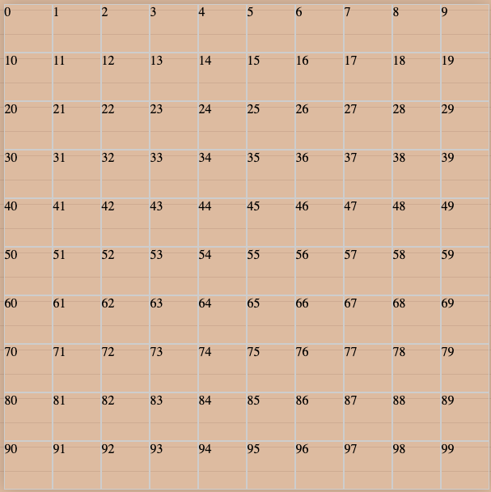
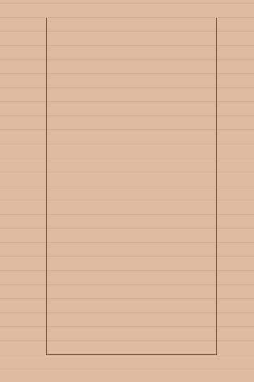
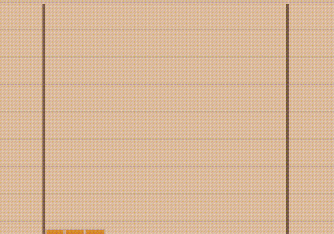
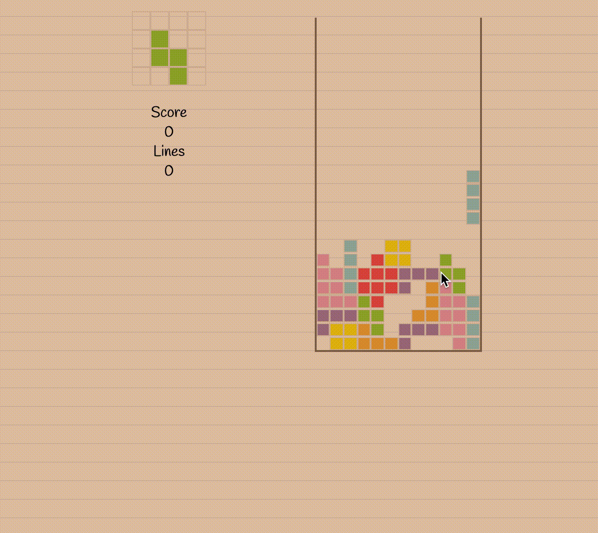
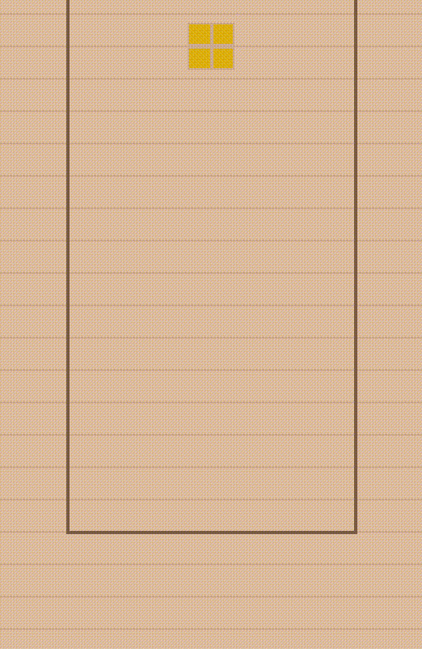
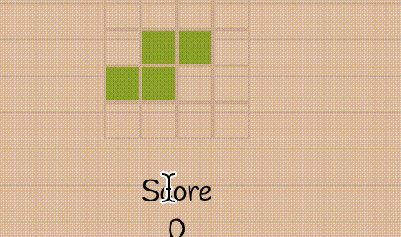

# SEI-Project-1: Paper Tetris

## Overview
At General Assembly were given the tasks for our first Project to work individually and build a game from the given selection using separate HTML CSS and JavaScript files. 

Canvas was forbidden in this project and DOM Manipulation was required to get more comfortable using Javascript. We were given a deadline of a week to build this working game and deploy it using a Github repository.

I decided to base my game on Tetris. 

Tetris is a puzzle game where the player has to fit different shaped blocks which can be rotated (called Tetriminos) together so that they make a complete line across the playing board. Once a line is achieved it is removed from the game board and the player’s score is increased.

The aim of the game is to get as many points as possible before the game board is filled with Tetriminos.

We were given the freedom to change the theme and alter the concept. I wanted to create a version of Tetris that hasn’t been made before so I decided to create a PaPer Tetris game.

You can find a live version of the app here:  [Paper Tetris](https://olulesi.github.io/sei-project-1/) 


## Brief 

* The game should stop if a Tetrimino fills the highest row of the game board.
* The player should be able to rotate each Tetrimino about its axis.
* If a line is completed it should be removed and the pieces above it should take their place.


## Technologies Used
* HTML5
* CSS3
* JavaScript (ES6)
* Git
* GitHub
* Google Fonts
* Google Chrome dev tools
* VScode
* Eslint
* Todoist

## Getting Started
The website is accessible through the web browser and does not require installing any dependencies. The game can be played using the keyboard (↑ ← → and Space bar).

## Demonstration of the App Flow 

<p style="text-align:center">
  
<p>

* The app flow is like any normal Tetris game you are to move left to right with the arrow keys. 
* The up arrow key allows you to change the rotation of the shape.
* The spacebar key allows you to move the shape to the bottom of the grid instantaneously.
* Also you can see the next shape in a window at the top left as well as the score increasing depending on line breaks.

## Creating the Game
## Plan



For most of my projects before GA, I used [todoist](https://todoist.com/) which is a project planning app similar to Trello but allows you to add multiple layers of subtasks. 

I broke my project up based on the key components of the Tetris game and moved from column to column as I progressed in building the game.

### Grid




The grid was my start point as planned since this is where all the functionality of the game would be happening. I proceeded to create 2 divs within each other in my HTML file one as the div itself representing each cell and one as the grid itself which is the container of the Tetris game.

My grid dimensions were slightly different as I wanted more of a long rectangle grid shape as my board and not a square so I had to make my grid height twice the height of a grid width.

Each div was labelled as a cell as I needed to keep track of all positions in the grid. Therefore I created a for loop to generate the accurate numbers of divs needed to create my Tetris grid with every cell being pushed into an array. A total of 288 cells for my grid.

Whilst I was working throughout the project until deployment I would have the text content of each div as its position to easily know what index I needed to use for the current position and functionality throughout the project but commented it out when it was ready for presentation.

```
function createGrid() {

    for (let i = 0; i < cellCount; i++) {
      const cell = document.createElement('div')
      cell.setAttribute('data-index', i)
      // cell.textContent = i
      cells.push(cell)
      // console.log(bottomRow[2].dataset.index)
      if (i >= cellCount - gridWidth) {
        bottomRow.push(cell)
      }
      grid.appendChild(cell)
    }

    // addShape(startPosition)
  }

```

### Shape Movement 

#### Shapes

For each shape, it had to be created based on a single position and the shapes can be filled from that index.  

I then added the add shape function to uniquely identify each shape on the grid.

I added colour to each of the shapes. Each shape generated was determined by the current shape and current rotation. Based on the shape provided a class of the shape colour would be added to each position of the shape. This would then be displayed starting from the current position which starts at the top centre of the grid.
I did this relative to the current position because I plan on the current position constantly changing when the game is played.


```
 name: 'Tshape',
        position2: 1,
        position3: 2,
        position4: 13,

function addShape() {
    cells[currPosition].classList.add(`${shapes[currShape][currRotation].name}`)
    cells[currPosition + shapes[currShape][currRotation].position2].classList.add(`${shapes[currShape][currRotation].name}`)
    cells[currPosition + shapes[currShape][currRotation].position3].classList.add(`${shapes[currShape][currRotation].name}`)
    cells[currPosition + shapes[currShape][currRotation].position4].classList.add(`${shapes[currShape][currRotation].name}`)
    // console.log(cells[position].classList.value === '')
  }


```


#### Automatic Movement

To start I set a time interval method that makes the current shape move consistently down one row.

However for the automatic movement not to break the game it needs to be moving to check if it can move to the next position with every keypress and interval.

Therefore I created a try move function where it:

* Has an arguement variable called change to indicate if the current position has changed due to key press left or right or rotation change.
* Updates the current position to the new position which is where it wants to move to.
* Removes the shape of its former current position to prevent the shape from increasing in size.
* Then runs several if statements to handle the different possible outcomes of the position it is trying to move to.
	* Such as:
	* If valid - add shape and keep playing.
	* If no space available - store the shape and add a new shape from the top of the grid.
	* If no possible moves can be made  - disable movement and the game will end.

```
function tryMove(change) {
    const newPosition = currPosition + change
    const newPosition2 = newPosition + shapes[currShape][currRotation].position2
    const newPosition3 = newPosition + shapes[currShape][currRotation].position3
    const newPosition4 = newPosition + shapes[currShape][currRotation].position4
    removeShape()
    if (currPosition + shapes[currShape][currRotation].position4 >= bottomRow[0].dataset.index) {
      storeShape()
      return
    }
    if (cells[newPosition].classList.value === '' && cells[newPosition2].classList.value === '' && cells[newPosition3].classList.value === '' && cells[newPosition4].classList.value === '') {
      currPosition = newPosition
      addShape()
    } else if (change === 0) {
      currPosition = -1
      console.log('game end')
    } else if (change === gridWidth) {
      storeShape()
    }
    // else if (change === gridWidth) {
    //   storeShape()
    // } else if (change === 0) {

    // }

    // if 5 is in filled array 
    // if new position cells are empty or not current shape class list
  }


```

#### Player movment


<p style="text-align:center">
  
<p>

I then implemented the player movement on the game. I used a switch statement on key up to handle each event. 

For each movement I only needed to keep track of the current position,  the change, the shape, it’s left and right width and the horizontal position when moving left and right.

The left and the right width for each shape is the width of the number of cells extra from the current position on the left and right-hand side.
So accounts for how many cells the current shape takes on the left and right side of the current position.

The number of moves the shape could possible make moving left to right limited by the right and left width to prevent the shape from going off the grid.

The change was important because it updates the current position as the shape moves to the left or right so the left arrow would be a change of -1 while the right would be a change of 1 with the interval movement of moving down being a change of 12.

Similar to the automatic movement the try move function would be called on every keypress to make sure the move is valid.


```
function handleKeyUp(event) {

    const horizontalPosition = currPosition % gridWidth
    // const verticalPosition = Math.floor(currPosition / gridWidth)
    // console.log(horizontalPosition)
  
    switch (event.keyCode) {

      case 39: //arrow right
        if (horizontalPosition < gridWidth - shapes[currShape][[currRotation]].rightWidth) tryMove(1)
        break
      case 37: //arrow left
        if (horizontalPosition >= shapes[currShape][[currRotation]].leftWidth) tryMove(-1)
        break

```


### Rotations

<p style="text-align:center">
  
<p>

For the rotations, I listed the possible rotations for each shape including the right and left width. 
This was used for making sure the edge of the shape doesn’t go off the grid. 


```
{
        rotation: 1,
        name: 'Tshape',
        position2: 1,
        position3: 2,
        position4: 13,
        rightWidth: 3,
        leftWidth: 1,
        nextPosition: 4,
        nextPosition2: 1,
        nextPosition3: 2,
        nextPosition4: 5,

      },
      {
        rotation: 2,
        name: 'Tshape',
        position2: 12,
        position3: 13,
        position4: 24,
        rightWidth: 2,
        leftWidth: 1,
        nextPosition: 5,
        nextPosition2: 4,
        nextPosition3: 5,
        nextPosition4: 8,
      },

```


#### Moving Rotation keys

For the shape rotation feature, I made it the arrow up key. This works because it changes the index of the current rotation mapping through the rotations array of that shape constantly providing a different rotation.

```
case 38: // arrow up
        removeShape()
        if (currRotation === shapes[currShape].length - 1) {
          currRotation = 0
        } else {
          currRotation++
        }
        addShape()
        break

```

### Row break 

<p style="text-align:center">
  
<p>

For the row break, I had to take into account 
* multiple lines breaking 
* the grid position of all the other shapes adjusting  after the row break
*  Knowing when a row is completed 

The completed lines required  2 for loops to go through every cell (c) in every row (r) and to check if all the cells had a non-empty class name as that would indicate a shape is present. Once this is determined I would first clear the row that is filled and move the rows down.

For the move rows down function, I simply looped through the rows starting at the clear row and stopping at the top row. Set each class list name of each cell to the row above it and at the top row clear the cells.

The clear row function would remove the class name from the cell providing its colour.

```
function completedLines() {
    for (let r = 1; r <= gridHeight; r++) {
      for (let c = 1; c <= gridWidth; c++) {
        const cellPosition = ((r - 1) * gridWidth) + (c - 1)
        if (cells[cellPosition].classList.value === '')
          break
        else if (c === gridWidth) {
          clearRow(r)
          scoreLine++
          lineScore.innerHTML = scoreLine
          totalScore.innerHTML = (scoreLine * 100)
          moveRowDown(r)
          r--
        }
      }
    }
  }

  function moveRowDown(row) {
    for (let r = row; r > 0; r--) {
      for (let c = 1; c <= gridWidth; c++) {
        const cellPosition = ((r - 1) * gridWidth) + (c - 1)
        const newCellPosition = ((r - 2) * gridWidth) + (c - 1)
        if (newCellPosition < 0) {
          clearRow(r)
        } else {
          cells[cellPosition].classList.value = cells[newCellPosition].classList.value
          if (!cells[newCellPosition].classList.value) {
            cells[newCellPosition].classList.value = ''
          }
        }

      }
    }
  }

  function clearRow(row) {
    for (let c = 1; c <= gridWidth; c++) {
      const cellPosition = ((row - 1) * gridWidth + (c - 1))
      cells[cellPosition].classList.value = ''
    }
  }

```


### SpaceBar Functionality

<p style="text-align:center">
  
<p>

```

  let shapeCounter = 0
  let shapeNumber  = 0


case 32: //spaceBar
        // if try move succesfull remove
        shapeNumber = shapeCounter
        do {
          tryMove(gridWidth)
        } while (shapeCounter === shapeNumber)
        break

function newShape() {
    currShape = nextShape
    currRotation = nextRotation
    currPosition = 5
    nextShape = generateRandomShapeIndex()
    nextRotation = generateRandomRotation()
    windowPosition = shapes[nextShape][nextRotation].nextPosition
    updateWindow(nextShape, nextRotation, windowPosition)
    tryMove(0)
    shapeCounter++
    console.log('newShape' + shapeCounter)
  }


```

The space bar functionality was an important piece as it is one of the main features of a Tetris game. 

I didn’t need to create a function I simply used the shape Counter and the shape Number to handle the functionality.

When every shape is added to the grid the shape counter increases by 1.
This represents a shape being stored meaning it can no longer move.

For the space bar, we want the shape to continuously go down to the lowest possible point.

So that can be done with the try move function checking row by row.
Therefore prompting me to do a do-while loop to consistently try move row by row until another shape is added which will mean the shape counter and shape number will be different.


### Up next Functionality

<p style="text-align:center">
  
<p>

The up next functionality was harder than I expected because I wanted my up next window to be a 4x4 grid which is different dimensions to the 12x24 game grid. 


```
function nextShapeGrid() {
    for (let i = 0; i < windowCellCount; i++) {
      const nextShapeCell = document.createElement('div')
      // nextShapeCell.textContent = i
      nextShapeCell.setAttribute('data-index', i)
      tetrisShape.appendChild(nextShapeCell)
      windowCells.push(nextShapeCell)
    }
  }

```

So for every shape, I had to add its next position dimensions which were also relative numbers to the start window position

```
let windowPosition = 0
  let shapeCounter = 0
  let shapeNumber  = 0


  const shapes = [
    [
      {
        name: 'boxShape',
        position2: 1,
        position3: 12,
        position4: 13,
        rightWidth: 2,
        leftWidth: 1,
        nextPosition: 5,
        nextPosition2: 1,
        nextPosition3: 4,
        nextPosition4: 5,
      }
    ],

```

Then I created an update window function which would be the display the next position dimensions on the grid which would consist of the next shape, the next rotation which are randomly generated index numbers and the next position which is the window position relative to the next shape and next rotation. 
This assigns the random shape to the correct cell on the window grid.

```
function updateWindow(nextShape, nextRotation, nextPosition) {
    for (let c = 0; c < windowCellCount; c++) {
      windowCells[c].classList.value = ''
    }
    windowCells[nextPosition].classList.add(`${shapes[nextShape][nextRotation].name}`)
    windowCells[nextPosition + shapes[nextShape][nextRotation].nextPosition2].classList.add(`${shapes[nextShape][nextRotation].name}`)
    windowCells[nextPosition + shapes[nextShape][nextRotation].nextPosition3].classList.add(`${shapes[nextShape][nextRotation].name}`)
    windowCells[nextPosition + shapes[nextShape][nextRotation].nextPosition4].classList.add(`${shapes[nextShape][nextRotation].name}`)
  }

```

Then I moved onto the new shape function which adds a new shape directly into the main grid. So I assign the main grid the shape of what the window shape grid is. Therefore linking the two to grids meaning the game grid gets all its shapes from the window grid. 

Then update the window grid to change once this has happened with random generators to select the next shape.

```
function newShape() {
    currShape = nextShape
    currRotation = nextRotation
    currPosition = 5
    nextShape = generateRandomShapeIndex()
    nextRotation = generateRandomRotation()
    windowPosition = shapes[nextShape][nextRotation].nextPosition
    updateWindow(nextShape, nextRotation, windowPosition)
    tryMove(0)
    shapeCounter++
    console.log('newShape' + shapeCounter)
  }

```

## Wins 
Completing the project on time was a big win. The shape rotations functionality, as well as the space bar functionality, were big wins. This is because they were the features in struggled in implementing efficiently. 

## Challenges
Time management: I struggled in managing my time to have enough styling at the end and my project suffered because of it. Also, I would have wanted to improve the scoring system. 

I also struggled in finding the most efficient way to generate all the shapes and rotations without writing each position numbers with the left and right width as well as the window position for each rotation of each shape.


## What I Learned 

This Project taught me about proper project planning and having a well-defined MVP. I was able to develop my understanding of javascript and DOM manipulation. In addition to having well-defined variables even if they are a bit longer than preferred as it makes it easier to reference making functions with many lines of code to reference.


## Future Features
I would have liked to add a hold feature to the Tetris game to improve its functionality. Also, creating more of a paper Tetris theme with audio and background features. 

Also, I would have liked to improve the scoring of the game as well as storage of high scores with a leaderboard feature.

